# Spring Data JPA Day 1

## Q1) Create an Employee Entity which contains the following fields:

- Name
- Id
- Age
- Location

  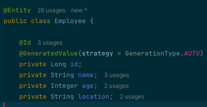

## Q2) Set up EmployeeRepository with Spring Data JPA
  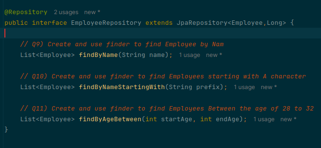
    

## Q3) Perform Create Operation on Entity using Spring Data JPA
  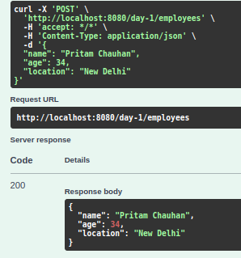

## Q4) Perform Update Operation on Entity using Spring Data JPA
  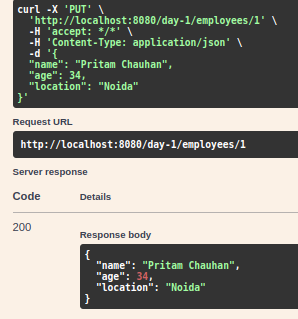

## Q5) Perform Delete Operation on Entity using Spring Data JPA
  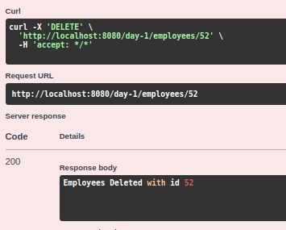

## Q6) Perform Read Operation on Entity using Spring Data JPA
  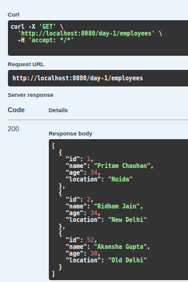

## Q7) Get the total count of the number of Employees
  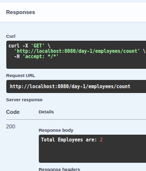

## Q8) Implement Pagination and Sorting on the bases of Employee Age
  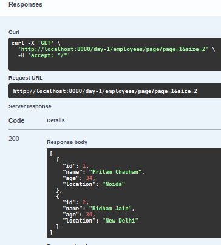

## Q9) Create and use finder to find Employee by Name
  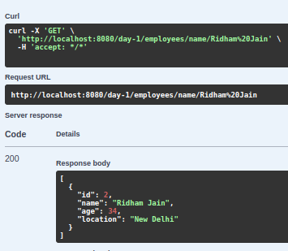

## Q10) Create and use finder to find Employees starting with A character
  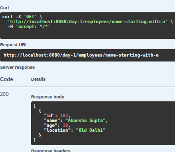
## Q11) Create and use finder to find Employees Between the age of 28 to 32
  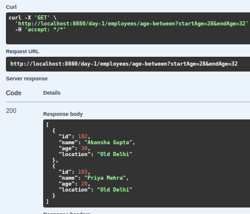