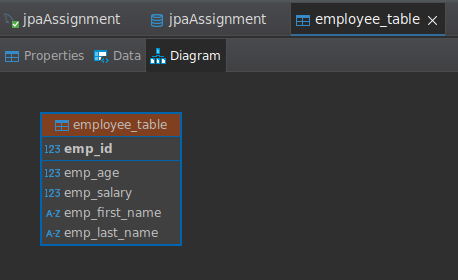
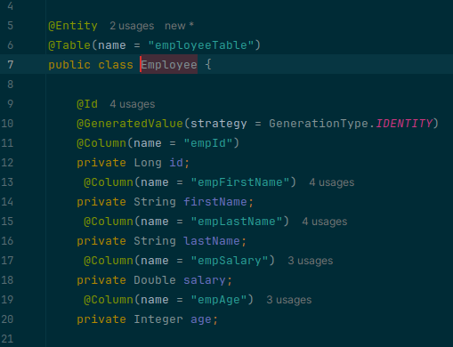
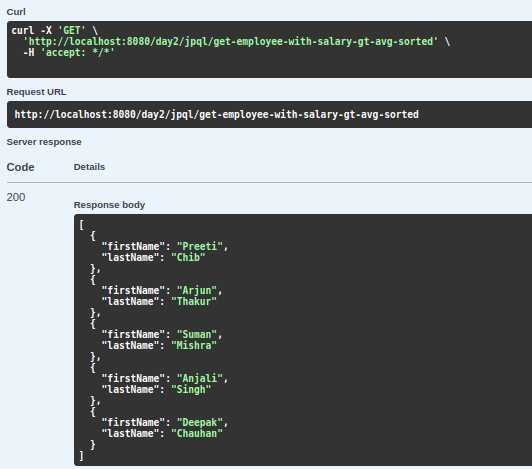
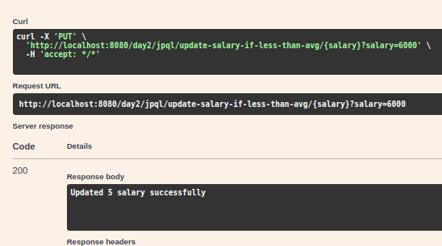
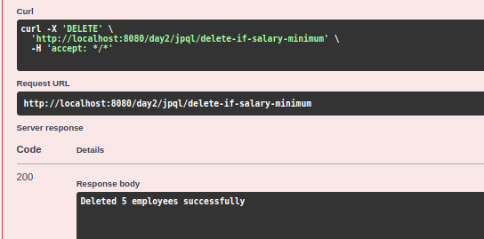
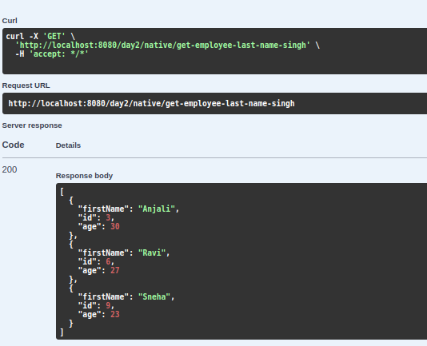
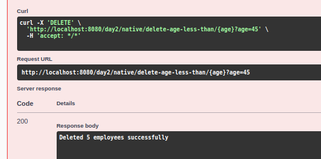
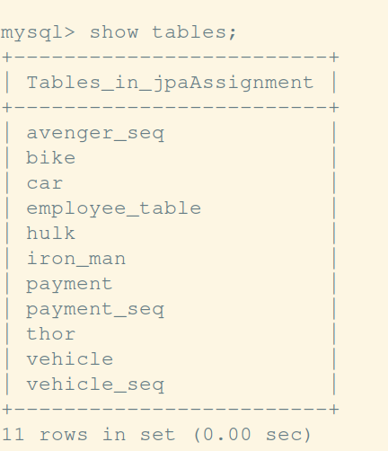
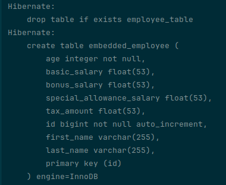

# Day 2 - Spring Data JPA

## JPQL Instructions
### A) Create an `employeeTable` table with the following fields:
- `empId`
- `empFirstName`
- `empLastName`
- `empSalary`
- `empAge`

- 

### B) Create an `Employee` entity with the following fields:
- `id`
- `firstName`
- `lastName`
- `salary`
- `age`  
  which maps to the table columns given above.

- 

## Questions
1) Display the first name, last name of all employees having salary greater than average salary ordered in ascending by their age and in descending by their salary.
    - 
2) Update salary of all employees by a salary passed as a parameter whose existing salary is less than the average salary.
    - 
3) Delete all employees with minimum salary.
    - 
---

## Native Query Instructions
### A) Create an `employeeTable` table with the following fields:
- `empId`
- `empFirstName`
- `empLastName`
- `empSalary`
- `empAge`

### B) Create an `Employee` entity with the following fields:
- `id`
- `firstName`
- `lastName`
- `salary`
- `age`  
  which maps to the table columns given above.

## Questions
1) Display the `id`, `firstName`, `age` of all employees where last name ends with `"singh"`.
   - 
2) Delete all employees with age greater than `45` (should be passed as a parameter).
   - 

---

# Inheritance Mapping

1) Implement and demonstrate **Single Table strategy**.
2) Implement and demonstrate **Joined strategy**.
3) Implement and demonstrate **Table Per Class strategy**.

- 
---

# Component Mapping
1) Implement and demonstrate **Embedded mapping** using `employee` table with the following fields:
    - `id`
    - `firstName`
    - `lastName`
    - `age`
    - `basicSalary`
    - `bonusSalary`
    - `taxAmount`
    - `specialAllowanceSalary`  

- 